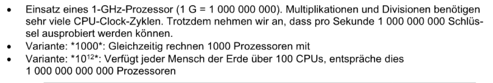
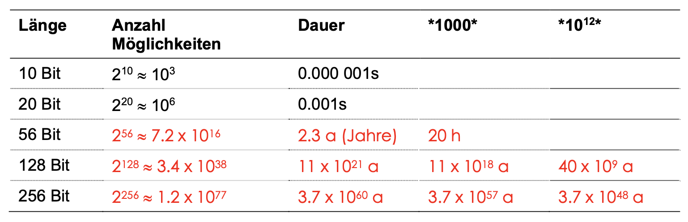
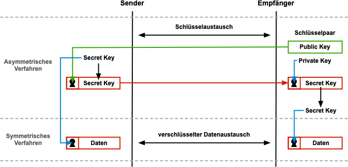
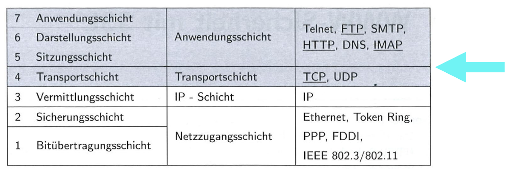
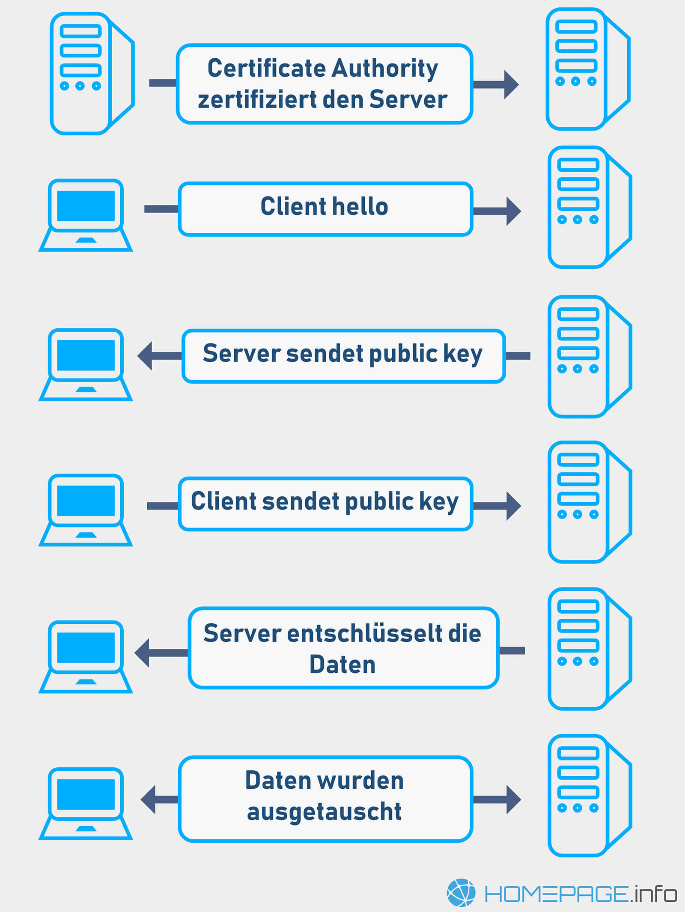
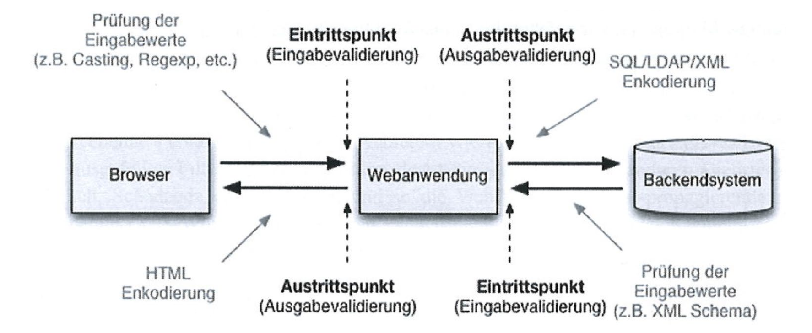
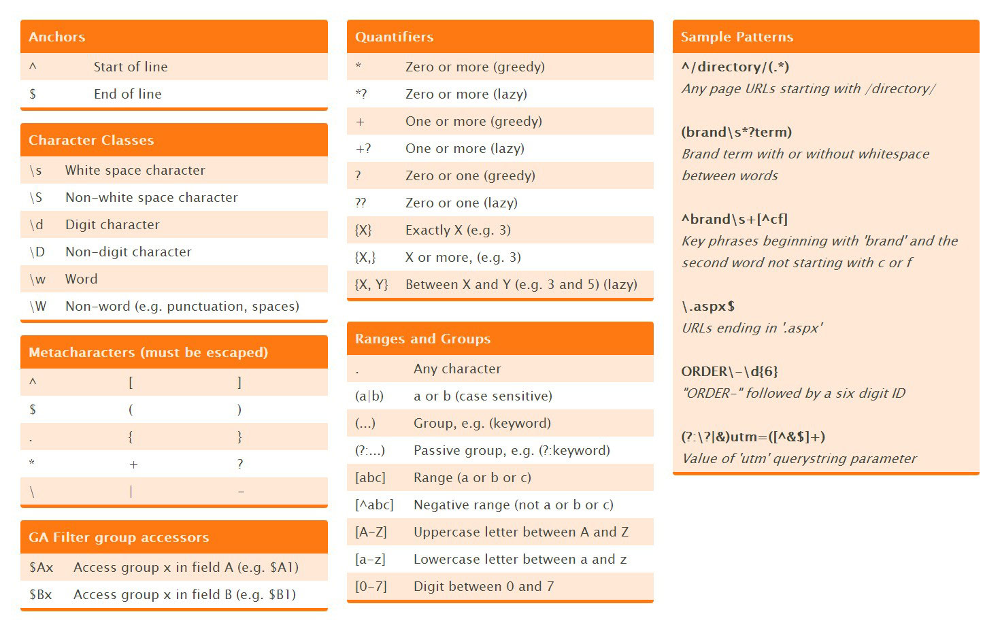

# M183 Summary P2

[TOC]


## SSL/TLS

### 1. Add Hosts

```cmd
code C:\Windows\System32\drivers\etc\hosts
```

### 2. Generate Cert

Use the script: `c:\xampp\apache\makecert.bat`  

:arrow_right: As Administrator

```cmd
cd c:\xampp\apache\ && .\makecert.bat
```

Country Name (2 letter code) [AU]: `CH`  
State or Province Name (full name) [Some-State]: `SG`  
Locality Name (eg, city) []: `St.Gallen`  
Organization Name (eg, company) [Internet Widgits Pty Ltd]: `GBSSG`  
Organizational Unit Name (eg, section) []: `IT`  
Common Name (e.g. server FQDN or YOUR name) []: `www.web.m183`  
Email Address []: `noreply@gbssg.ch` 

:arrow_right: **PUBLIC**: `c:\xampp\apache\conf\ssl.crt\server.crt`  
:arrow_right: **PRIVATE**: `c:\xampp\apache\conf\ssl.key\server.key`

### 3. Import Cert

Run: `certmgr.msc`

→ 'Eigene Zertifikate' - Alle Aufgaben - Importieren (c:\xampp\apache\conf\ssl.crt\server.crt)

### Possibility to Crack Private Key





### Symmetric vs Asymmetric Keys



**Symmetric**

Bei der **symmetrischen Verschlüsselung**, auch **Secret-Key Verschlüsselung** genannt, verwendet man – im Gegensatz zur asymmetrischen Verschlüsselung – **nur einen Schlüssel zum Verschlüsseln** und **Entschlüsseln**. Man unterscheidet die **symmetrischen Verschlüsselungsverfahren** nach **Blockchiffre-basierten Verfahren** und **Stromchiffren**.

Source: [studyflix.de](https://studyflix.de/)

**Asymmetric**

Die **Asymmetrische Kryptographie**, auch **Public-Key Verschlüsselung** genannt, ist durch ein **Schlüsselpaar** charakterisiert, das aus einem **nicht-geheimen öffentlichen Schlüssel (public key)** und einem **geheimen privaten Schlüssel (private key)** besteht. Der **private Schlüssel** darf dabei **nicht** in absehbarer Zeit (Jahre) **aus** dem **öffentlichen Schlüssel berechnet** werden können.

Der **öffentliche Schlüssel** ermöglicht es, Daten für den Besitzer des **privaten Schlüssels** zu verschlüsseln, dessen **digitale Signatur** zu prüfen oder ihn zu authentisieren. Dagegen kann der Besitzer des **privaten Schlüssels** die zuvor mit dem **öffentlichen Schlüssel** verschlüsselten Daten **entschlüsseln** oder **digitale Signaturen** erzeugen.

→ Digitale Signatur valide = Integrität gegeben

Source: [studyflix.de](https://studyflix.de/)

### Special Case: SSL/TLS



---



→ Client has a temporary session key (public & private key)

## Secure Web Forms

### Template / HTML Elements

> :exclamation: Don't use `required` or `type="email"` for easier testing of the form. :exclamation:

```html
<form method="post">
  <!-- INPUT FIELD -->
  <!-- set value: value="" -->
  <div>
    <label for="vorname">Vorname</label>
    <input type="text" name="vorname" id="vorname" value="John Doe" />
  </div>

  <!-- RADIO -->
  <!-- set value: checked -->
  <div>
    <input type="radio" name="anrede" id="herr" value="mr" checked>
    <label for="herr">Herr</label>

    <input type="radio" name="anrede" id="frau" value="ms">
    <label for="frau">Frau</label>
  </div>

  <!-- SINGLE SELECT -->
  <!-- set value: selected -->
  <div>
    <label for="anzahl">Anzahl Karten</label>
    <select name="anzahl" id="anzahl">
      <option value="" selected disabled>Bitte wählen</option>
      <option value="1">1</option>
      <option value="2" selected>2</option>
      <option value="3">3</option>
      <option value="4">4</option>
    </select>
  </div>

  <!-- MULTI SELECT -->
  <!-- set value: selected -->
  <div>
    <label for="sektion">Gewünschte Sektion im Stadion</label>
    <select name="sektion[]" size="4" multiple="multiple" id="sektion">
      <option value="nord">Nordkurve</option>
      <option value="sued" selected>Südkurve</option>
      <option value="haupt">Haupttribüne</option>
      <option value="gegen" selected>Gegentribüne</option>
    </select>
  </div>

  <!-- TEXTAREA -->
  <!-- set value: >...< -->
  <div>
    <label for="kommentare">Kommentare/Anmerkungen</label>
    <textarea cols="70" rows="10" name="kommentare" id="kommentare">Lorem ipsum ...</textarea>
  </div>

  <!-- CHECKBOX -->
  <!-- set value: checked -->
  <div>
    <label for="agb">Ich akzeptiere die AGB.</label>
    <input type="checkbox" name="agb" id="agb" value="true" checked />
  </div>

  <!-- SUMBIT -->
  <div>
    <button type="submit">Send</button>
  </div>
</form>
```

### Validation



:exclamation: always test on FE & BE :exclamation:

---

Checklist:

1. Get Form Field
   ```php
   $field = Helpers::getFormField('field');
   $fieldInt = Helpers::getFormField('num', FieldTypes::int);

   $fieldLongText = Helpers::getFormFieldLongText('field');
   ```
2. Check type & (Check if has content [if required])
   ```php
   // type check is already done by Helpers::getFormField
   if (!$field) {
     array_push($errors, 'Field was not supplied');
   }
   ```
   _Manual Type Check_:
   1. `is_string()`
   2. `is_bool()`
   3. `is_float()`
   4. `is_numeric()`
   5. `is_int()`
   6. `is_array()`
   7. `is_object()`
3. Further validation (e.g. array includes, regex)  
   _Array Includes:_
   ```php
   $salutation = Helpers::getFormField('salutation');
   $salutations = ['mr','ms'];
   // $salutations = Helpers::getJson('data.json')->salutations;
   if (!Helpers::array_includes($salutation, $salutations)) {
     array_push($errors, 'Invalid Salutation supplied');
   }
   ```
   _Regex:_ :arrow_right: [How to Regex](#regex)
   ```php
   $regex = '/^(.+)$/';
   $string = 'hello world';
   if (preg_match($regex, $string, $matches)) {
     // matches -> $matches
   } else {
     // not matches
   }
   ```

#### Regex

| Pattern                    | Regex                                                                                                                                                                                                                                                                                                                                                                                                                                                                                                                                                                                                                                                                                 | Example                                 |
| -------------------------- | ------------------------------------------------------------------------------------------------------------------------------------------------------------------------------------------------------------------------------------------------------------------------------------------------------------------------------------------------------------------------------------------------------------------------------------------------------------------------------------------------------------------------------------------------------------------------------------------------------------------------------------------------------------------------------------- | --------------------------------------- |
| email simple               | `^[^@ \t\r\n]+@[^@ \t\r\n]+\.[^@ \t\r\n]+$`                                                                                                                                                                                                                                                                                                                                                                                                                                                                                                                                                                                                                                           | me@domain.ch                            |
| international phone number | `^[\+]?[(]?[0-9]{3}[)]?[-\s\.]?[0-9]{3}[-\s\.]?[0-9]{4,6}$`                                                                                                                                                                                                                                                                                                                                                                                                                                                                                                                                                                                                                           | +41797364812 \| 0791234567              |
| swiss phone number         | `^(0|\(0\))?([1-9]\d{1})(\d{3})(\d{2})(\d{2})$`                                                                                                                                                                                                                                                                                                                                                                                                                                                                                                                                                                                                                                       | 0791234567                              |
| credit card number         | `(^4[0-9]{12}(?:[0-9]{3})?$)|(^(?:5[1-5][0-9]{2}|222[1-9]|22[3-9][0-9]|2[3-6][0-9]{2}|27[01][0-9]|2720)[0-9]{12}$)|(3[47][0-9]{13})|(^3(?:0[0-5]|[68][0-9])[0-9]{11}$)|(^6(?:011|5[0-9]{2})[0-9]{12}$)|(^(?:2131|1800|35\d{3})\d{11}$)`                                                                                                                                                                                                                                                                                                                                                                                                                                               | 4569403961014710                        |
| IPv4                       | `(\b25[0-5]|\b2[0-4][0-9]|\b[01]?[0-9][0-9]?)(\.(25[0-5]|2[0-4][0-9]|[01]?[0-9][0-9]?)){3}`                                                                                                                                                                                                                                                                                                                                                                                                                                                                                                                                                                                           | 192.168.1.1 \| 127.0.0.1                |
| IPv6                       | `(([0-9a-fA-F]{1,4}:){7,7}[0-9a-fA-F]{1,4}|([0-9a-fA-F]{1,4}:){1,7}:|([0-9a-fA-F]{1,4}:){1,6}:[0-9a-fA-F]{1,4}|([0-9a-fA-F]{1,4}:){1,5}(:[0-9a-fA-F]{1,4}){1,2}|([0-9a-fA-F]{1,4}:){1,4}(:[0-9a-fA-F]{1,4}){1,3}|([0-9a-fA-F]{1,4}:){1,3}(:[0-9a-fA-F]{1,4}){1,4}|([0-9a-fA-F]{1,4}:){1,2}(:[0-9a-fA-F]{1,4}){1,5}|[0-9a-fA-F]{1,4}:((:[0-9a-fA-F]{1,4}){1,6})|:((:[0-9a-fA-F]{1,4}){1,7}|:)|fe80:(:[0-9a-fA-F]{0,4}){0,4}%[0-9a-zA-Z]{1,}|::(ffff(:0{1,4}){0,1}:){0,1}((25[0-5]|(2[0-4]|1{0,1}[0-9]){0,1}[0-9])\.){3,3}(25[0-5]|(2[0-4]|1{0,1}[0-9]){0,1}[0-9])|([0-9a-fA-F]{1,4}:){1,4}:((25[0-5]|(2[0-4]|1{0,1}[0-9]){0,1}[0-9])\.){3,3}(25[0-5]|(2[0-4]|1{0,1}[0-9]){0,1}[0-9]))` | 2001:0db8:85a3:0000:0000:8a2e:0370:7334 |

Source: [ihateregex.io](https://ihateregex.io/)

---



## Example Form

```php
<!DOCTYPE html>
<html lang="en">

<?php
require_once './helpers.php';

$errors = [];

#region Form Fields
$anrede = Helpers::getFormField('Anrede');
$vorname = Helpers::getFormField('Vorname');
$nachname = Helpers::getFormField('Nachname');
$email = Helpers::getFormField('Email');
$promo = Helpers::getFormField('Promo');
$anzahl = Helpers::getFormField('Anzahl', FieldTypes::int);
$kommentare = Helpers::getFormFieldLongText('Kommentare');
$sektion = Helpers::getFormField('Sektion', FieldTypes::array);
$agb = Helpers::getFormField('AGB', FieldTypes::boolean);
#endregion Form Fields

$reset = Helpers::getFormField('reset');
if ($reset) {
  $anrede = null;
  $vorname = null;
  $nachname = null;
  $email = null;
  $promo = null;
  $anzahl = null;
  $kommentare = null;
  $sektion = null;
  $agb = null;
}

if (Helpers::isPost()) {
  // Helpers::preventReSubmit();

  if (!$anrede) {
    array_push($errors, 'Keine Anrede angegeben');
  }
  $anreden = ['mr', 'ms'];
  if (!Helpers::array_includes($anrede, $anreden)) {
    array_push($errors, 'Keine gültige Anrede angegeben');
  }

  if (!$vorname) {
    array_push($errors, 'Keinen Vornamen angegeben');
  }

  if (!$nachname) {
    array_push($errors, 'Keinen Nachname angegeben');
  }

  if (!$email) {
    array_push($errors, 'Keine Email angegeben');
  }
  if ($email && !Helpers::formatEmail($email)) {
    array_push($errors, 'Keine gültige Email angegeben');
  }

  $promoCodes = Helpers::getJson('promo.json')->promos;
  if ($promo && !Helpers::array_includes($promo, $promoCodes)) {
    array_push($errors, 'Ungültiger Promo-Code eingegeben');
  }

  if (!$anzahl) {
    array_push($errors, 'Keine Anzahl Tickets angegeben');
  }

  if (!$sektion) {
    array_push($errors, 'Keine Sektion(en) ausgewählt');
  }


  if (!$agb) {
    array_push($errors, 'Die AGBs wurden nicht akzeptiert');
  }
}
?>

<head>
  <meta charset="UTF-8">
  <meta http-equiv="X-UA-Compatible" content="IE=edge">
  <meta name="viewport" content="width=device-width, initial-scale=1.0">
  <title>Bestellformular</title>

  <style>
    @charset "UTF-8";

    form>div {
      margin-bottom: 10px;
    }

    .mt {
      margin-top: 20px;
    }

    .form-detail__container span {
      font-weight: 600;
    }

    .form-detail__container>div>p,
    .form-detail__container>div>span {
      display: inline;
    }
  </style>
</head>

<body>
  <h1>WM-Ticketservice</h1>

  <?php
  if (count($errors) && !$reset) :
  ?>

    <div class="form-errors">
      <h2>Folgende Fehler sind aufgetreten:</h2>

      <ul>
        <?php
        foreach ($errors as $error) :
        ?>
          <li><?php echo $error; ?></li>
        <?php
        endforeach;
        ?>
      </ul>
    </div>

  <?php
  endif;

  if (Helpers::isPost() && !$errors) :
  ?>

    <div class="form-detail">
      <h2>Besten Dank!</h2>
      <h3>Ihre Angaben:</h3>

      <div class="mt form-detail__container">
        <div>
          <span>Anrede:</span>
          <p><?php echo $anrede; ?></p>
        </div>
        <div>
          <span>Vorname:</span>
          <p><?php echo $vorname; ?></p>
        </div>
        <div>
          <span>Nachname:</span>
          <p><?php echo $nachname; ?></p>
        </div>
        <div>
          <span>Email:</span>
          <p><?php echo $email; ?></p>
        </div>
        <div>
          <span>Promo:</span>
          <p><?php echo $promo; ?></p>
        </div>
        <div>
          <span>Anzahl Karten:</span>
          <p><?php echo $anzahl; ?></p>
        </div>
        <div>
          <span>Sektion:</span>
          <p><?php echo join(' ', $sektion); ?></p>
        </div>
        <div>
          <span>Kommentar:</span>
          <div>
            <p><?php echo ($kommentare) ? $kommentare : '-- keinen --'; ?></p>
          </div>
        </div>
        <div>
          <span>AGB:</span>
          <p><?php echo ($agb) ? '✅' : ''; ?></p>
        </div>
      </div>
    </div>

  <?php

  else :
  ?>

    <div class="mt form">
      <form method="POST">
        <div>
          <input type="radio" name="Anrede" id="herr" value="mr" <?php if ($anrede === 'mr') : echo 'checked';
                                                                  endif; ?>>
          <label for="herr">Herr</label>

          <input type="radio" name="Anrede" id="frau" value="ms" <?php if ($anrede === 'ms') : echo 'checked';
                                                                  endif; ?>>
          <label for="frau">Frau</label>
        </div>

        <div>
          <label for="vorname">Vorname</label>
          <input type="text" name="Vorname" id="vorname" value="<?php echo $vorname; ?>" />
        </div>

        <div>
          <label for="nachname">Nachname</label>
          <input type="text" name="Nachname" id="nachname" value="<?php echo $nachname; ?>" />
        </div>

        <div>
          <label for="email">E-Mail-Adresse </label>
          <input type="text" name="Email" id="email" value="<?php echo $email; ?>" />
        </div>

        <div>
          <label for="promo">Promo-Code</label>
          <input type="password" name="Promo" id="promo" value="<?php echo $promo; ?>" />
        </div>

        <div>
          <label for="anzahl">Anzahl Karten</label>
          <select name="Anzahl" id="anzahl">
            <option value="" disabled <?php if (!$anzahl) : echo 'selected';
                                      endif; ?>>Bitte wählen</option>
            <option value="1" <?php if ($anzahl === 1) : echo 'selected';
                              endif; ?>>1</option>
            <option value="2" <?php if ($anzahl === 2) : echo 'selected';
                              endif; ?>>2</option>
            <option value="3" <?php if ($anzahl === 3) : echo 'selected';
                              endif; ?>>3</option>
            <option value="4" <?php if ($anzahl === 4) : echo 'selected';
                              endif; ?>>4</option>
          </select>
        </div>

        <div>
          <label for="sektion">Gewünschte Sektion im Stadion</label>
          <select name="Sektion[]" size="4" multiple="multiple" id="sektion">
            <option value="nord" <?php if ($sektion && Helpers::array_includes('nord', $sektion)) : echo 'selected';
                                  endif; ?>>Nordkurve</option>
            <option value="sued" <?php if ($sektion && Helpers::array_includes('sued', $sektion)) : echo 'selected';
                                  endif; ?>>Südkurve</option>
            <option value="haupt" <?php if ($sektion && Helpers::array_includes('haupt', $sektion)) : echo 'selected';
                                  endif; ?>>Haupttribüne</option>
            <option value="gegen" <?php if ($sektion && Helpers::array_includes('gegen', $sektion)) : echo 'selected';
                                  endif; ?>>Gegentribüne</option>
          </select>
        </div>

        <div>
          <label for="kommentare">Kommentare/Anmerkungen</label>
          <!-- SpecialCase: textarea when still edit, no Helpers::getFormFieldLongText -->
          <textarea cols="70" rows="10" name="Kommentare" id="kommentare"><?php echo Helpers::getFormField('Kommentare'); ?></textarea>
        </div>

        <div class="mt">
          <label for="agb">Ich akzeptiere die AGB.</label>
          <input type="checkbox" name="AGB" id="agb" value="error" <?php if ($agb) : echo 'checked';
                                                                    endif; ?> />
        </div>

        <div class="mt">
          <button type="submit">Bestellung aufgeben</button>
          <button type="submit" name="reset" value="true">Formular zurücksetzen</button>
        </div>
      </form>
    </div>

  <?php
  endif;
  ?>
</body>

</html>
```

## Helper

```php
<?php

abstract class Helpers
{
    private static bool $isSanitized = false;

    /**
     * static constructor
     */
    public static function init()
    {
        self::sanitizePostAndGet();
    }

    /**
     * print out variable in debug
     * @param mixed $output variable to print
     */
    public static function debug(mixed $output)
    {
        echo '<pre>';

        if (is_array($output) || is_object($output)) {
            print_r($output);
        } else {
            var_dump($output);
        }

        echo '</pre>';
    }

    /**
     * sanitize html input and prevent xss.
     * **IMPORTANT:** POST and GET variables are already sanitized!
     * @param string $input string to sanitize
     */
    public static function sanitize(string $input)
    {
        return htmlspecialchars($input);
    }

    /**
     * sanitizes global GET and POST variables
     */
    private static function sanitizePostAndGet()
    {
        global $_GET;
        global $_POST;
        $_GET = filter_input_array(INPUT_GET, FILTER_SANITIZE_FULL_SPECIAL_CHARS);
        $_POST = filter_input_array(INPUT_POST, FILTER_SANITIZE_FULL_SPECIAL_CHARS);

        self::$isSanitized = true;
    }

    /**
     * get a form field
     * @param string $key key of field (= name)
     * @param FieldTypes $type type of the field - default `FieldTypes::string`
     * @return null|array|object|mixed form field
     */
    public static function getFormField(string $key, FieldTypes $type = FieldTypes::string)
    {
        if (!self::$isSanitized) {
            self::sanitizePostAndGet();
        }

        if (!$_POST || ($_POST && !array_key_exists($key, $_POST))) {
            return null;
        }

        if (is_array($_POST[$key]) || is_object($_POST[$key])) {
            $value = self::checkType($_POST[$key], $type);
            return ($value) ? $_POST[$key] : null;
        }

        $value = self::checkType(trim($_POST[$key]), $type);
        return ($value) ? $value : null;
    }

    /**
     * get a form field with long text.
     * includes convert from nl to html <br />
     * @param string $key key of field with long text / textarea (= name)
     * @return string|null form field text - `null` if not string
     */
    public static function getFormFieldLongText(string $key)
    {
        $formField = self::getFormField($key);

        if (!is_string($formField)) {
            return null;
        }

        return nl2br(self::getFormField($key));
    }

    /**
     * get a json object
     * @param string $path relative path
     * @return object json object
     */
    public static function getJson(string $path)
    {
        $json = file_get_contents($path);
        $object = json_decode($json);
        return $object;
    }

    /**
     * if is a form post back
     */
    public static function isPost()
    {
        return $_POST && count($_POST);
    }

    /**
     * prevent a resubmit of the form with a JS approach
     */
    public static function preventReSubmit()
    {

        echo "
        <script>
            if (window.history.replaceState) {
                window.history.replaceState(null, null, window.location.href);
                console.log('cleared');
            }
        </script>
        ";
    }

    /**
     * check for valid email and get email parts
     * @param string $email email to test
     * @return bool|string[] `false` if no email - `string[]` with parts if valid email
     * 
     * `string[1]` => mailbox  
     * `string[2]` => domain name  
     * `string[3]` => tld  
     */
    public static function formatEmail(string $email)
    {
        // @see https://ihateregex.io/expr/email/
        $emailPattern = '/^([^@ \t\r\n]+)@([^@ \t\r\n\.]+)\.([^@ \t\r\n]{2,6})$/';

        if (preg_match($emailPattern, $email, $matches)) {
            return $matches;
        } else {
            return false;
        }
    }

    /**
     * casts a value to specified type and checks if type matches
     * @param mixed $value value to check for type
     * @param FieldType $type type to check
     * @return mixed|bool value with specified type - `false` if type does not match
     */
    public static function checkType(mixed $value, FieldTypes $type)
    {
        switch ($type) {
            case FieldTypes::string:
                $value = strval($value);
                return (is_string($value)) ? $value : false;
                break;
            case FieldTypes::boolean:
                $value = boolval($value);
                return (is_bool($value)) ? $value : false;
                break;
            case FieldTypes::int:
                $value = intval($value);
                return (is_int($value)) ? $value : false;
                break;
            case FieldTypes::double:
                $value = doubleval($value);
                return (is_double($value)) ? $value : false;
                break;
            case FieldTypes::array:
                return (is_array($value)) ? $value : false;
                break;
            case FieldTypes::object:
                return (is_object($value)) ? $value : false;
                break;
        }

        return false;
    }

    /**
     * check if array includes an element
     * @param mixed $element element to check
     * @param array $array array to check
     * @return bool array includes element
     */
    public static function array_includes(mixed $element, array $array)
    {
        return array_search($element, $array) !== false;
    }
}

/**
 * possible field types for type check
 */
enum FieldTypes
{
    case string;
    case boolean;
    case int;
    case double;
    case array;
    case object;
}

Helpers::init();
```

