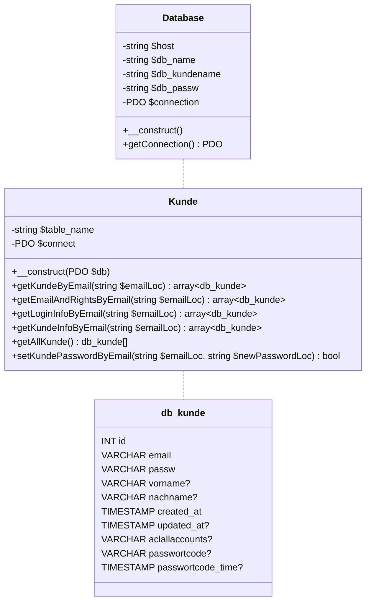

# M183 Summary P3

[TOC]

## Recap: Secured Input

- `isset($_POST["field"])`
- `empty($_POST["field"])`
- `is_string($_POST["field"])`
    - is_float
    - is_int
    - is_bool
    - is_object
    - is_array
- `strval($_POST["field"])`
    - floatval
    - intval
    - boolval
- `htmlspecialchars($_POST["field"])`

## PDO

### Establish Connection

```php
try { 
    $this->connection = new PDO("mysql:host=" . $this->host . ";dbname=" . $this->db_name, $this->db_kundename, $this->db_passw); 
} 
catch (PDOException $e) {
    // return error code to user
}
```

### DQL

```php
$statement = $this->connection->prepare("SELECT email, vorname, nachname, created_at, updated_at FROM " . $this->table_name . " WHERE email = :param_email;");
$successful = $statement->execute(array('param_email' => $email));

if (!$successful) {
    print_r($statement->errorInfo());
}

# one row
$statement->fetch();

# all rows 
$statement->fetchAll(); // foreach ($kunden as $kunde)
```

### DML

```php
$statement = $this->connection->prepare("DELETE FROM " . $this->table_name . " WHERE email = :param_email;");
$successful = $statement->execute(array('param_email' => $email));

// INSERT INTO:
$id = $this->connection->lastInsertId();
```

## API



## Debugging

### Add PHP XDebug extension

1. Stop XAMPP: `apache`
2. Copy [php_xdebug.dll](./summary-p3/php_xdebug.dll) to `c:\xampp\php\ext`
3. Edit `c:\xampp\php\php.ini`:
   ```ini
   ; eof

   [xdebug]
   zend_extension = "c:\xampp\php\ext\php_xdebug.dll"
   xdebug.mode=develop,debug
   xdebug.client_host=127.0.0.1
   xdebug.client_port=9003
   xdebug.start_with_request=yes
   ```
4. Start XAMPP: `apache`

### Visual Studio Code

"Run and Debug" → "create a launch.json file" → PHP

To Debug: `Listen for Xdebug`

### PhpStorm


