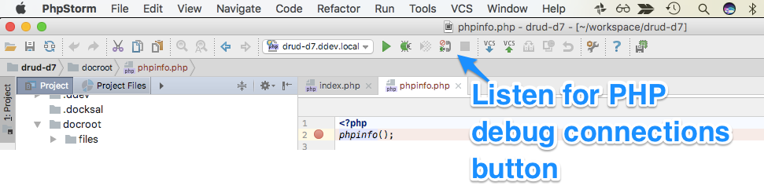

# M183 Summary P3

[TOC]

## Recap: Secured Input

- `isset($_POST["field"])`
- `empty($_POST["field"])`
- `is_string($_POST["field"])`
    - is_float
    - is_int
    - is_bool
    - is_object
    - is_array
- `strval($_POST["field"])`
    - floatval
    - intval
    - boolval
- `htmlspecialchars($_POST["field"])`

## Session Handling

> `$_SESSION`

Start Session:

`session_start(array $options = []): bool`

---

Get Session Id:

`session_id(string $id = null): string|false`

---

Regenerate Id:

`session_regenerate_id(bool $delete_old_session = false): bool`

---

End Session:

`session_abort(): bool`

→ reload site or `session_start()`

### Expiration

```php
$SESSION_EXPIRATION_SECONDS = 5 * 60;
if (isset($_SESSION['LAST_ACTIVITY']) && (time() - $_SESSION['LAST_ACTIVITY'] >= $SESSION_EXPIRATION_SECONDS)) {
    // session expired
    session_regenerate_id() && session_abort();
}

$_SESSION['LAST_ACTIVITY'] = time();
```

### Prevent Hijacking 

```php
$ipAddress = $_SESSION['IP_ADDRESS'];
if (isset($ipAddress) && $_SERVER['REMOTE_ADDR'] !== $ipAddress) {
    // session invalid
    session_regenerate_id() && session_abort();
} else {
    $_SESSION['IP_ADDRESS'] = $_SERVER['REMOTE_ADDR'];
}

# ---

$userAgent = $_SESSION['USER_AGENT'];
if (isset($userAgent) && $_SERVER['HTTP_USER_AGENT'] !== $userAgent) {
    // session invalid
    session_regenerate_id() && session_abort();
} else {
    $_SESSION['USER_AGENT'] = $_SERVER['HTTP_USER_AGENT'];
}
```

## Password Security

> → (characters)^(length)


## PDO

### Establish Connection

```php
try { 
    $this->connection = new PDO("mysql:host=" . $this->host . ";dbname=" . $this->db_name, $this->db_kundename, $this->db_passw); 
} 
catch (PDOException $e) {
    // return error code to user
}
```

### DQL

```php
$statement = $this->connection->prepare("SELECT email, vorname, nachname, created_at, updated_at FROM " . $this->table_name . " WHERE email = :param_email;");
$successful = $statement->execute(array('param_email' => $email));

if (!$successful) {
    print_r($statement->errorInfo());
}

# one row
$statement->fetch();

# all rows 
$statement->fetchAll(); // foreach ($kunden as $kunde)
```

### DML

```php
$statement = $this->connection->prepare("DELETE FROM " . $this->table_name . " WHERE email = :param_email;");
$successful = $statement->execute(array('param_email' => $email));

// INSERT INTO:
$id = $this->connection->lastInsertId();
```

## WebShop

### States


### Interactions


### API


<!--
## Access Models

|     |     |
| --- | --- |
| **MAC** <br /> (Mandatory Access Control) | System based Access Control (e.g. IP Whitelist) - Source Code does not check for Auth |
| **DAC** <br /> (Descretionary Access Control) | text |


|     |     |
| --- | --- |
|  |  |

## Access Control Types

### Explicit Protection

text

#### Trusted Subsystem Model 

Access BE through (single) Service User


#### Separated Trusted Sybsystem Model

Access BE different zones (public, secured) through different Service User


#### Identity Propagation

Delegation of BE permission to access through user itself


### Implicit Protection

text
-->

## Debugging

### Add PHP XDebug extension

1. Stop XAMPP: `apache`
2. Copy [php_xdebug.dll](./summary-p3/php_xdebug.dll) to `c:\xampp\php\ext`
3. Edit `c:\xampp\php\php.ini`:
   ```ini
   ; eof

   [xdebug]
   zend_extension = "c:\xampp\php\ext\php_xdebug.dll"
   xdebug.mode=develop,debug
   xdebug.client_host=127.0.0.1
   xdebug.client_port=9003
   xdebug.start_with_request=yes
   ```
4. Start XAMPP: `apache`

### Visual Studio Code

"Run and Debug" → "create a launch.json file" → PHP

To Debug: `Listen for Xdebug`

### PhpStorm


